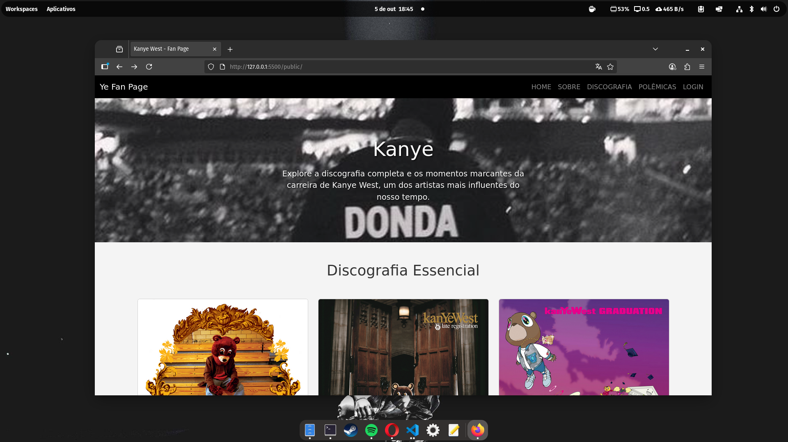
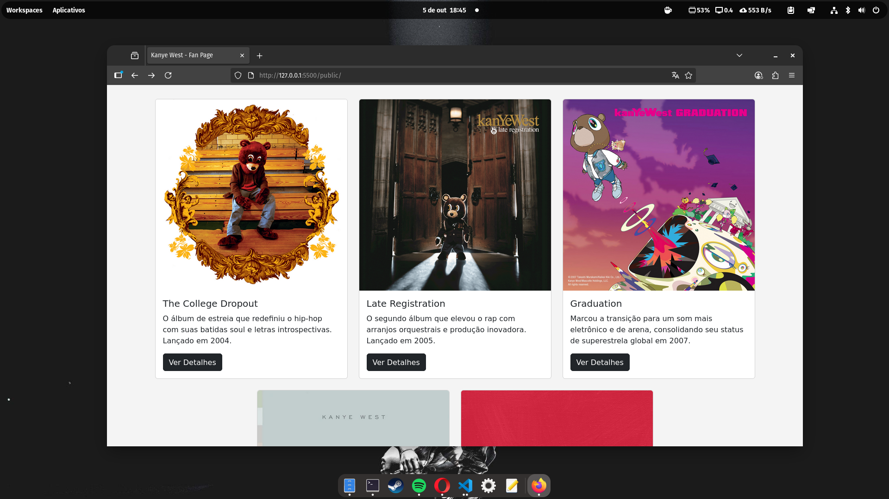
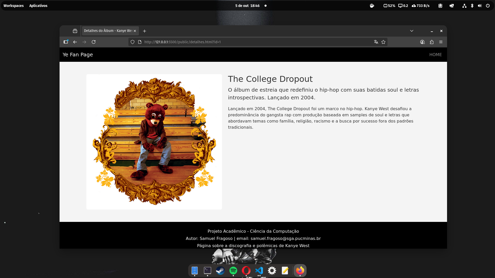

# 🎵 Ye Fan Page

> Projeto de desenvolvimento web focado na discografia e carreira do artista Kanye West (Ye).


[](https://github.com/amuelfragosoye/yeye)

### Autor
 `Samuel Teodoro Albuquerque Fragoso`

## 📋 Sobre o Projeto

Este projeto foi desenvolvido como parte da disciplina de **Desenvolvimento de Interfaces Web**. O objetivo foi consolidar conhecimentos em Front-end e integração com API REST simulada.

A aplicação é uma Single Page Application (conceitual) que apresenta a discografia, biografia e polêmicas do rapper Ye, permitindo interatividade como pesquisa, cadastro de itens (CRUD) e sistema de favoritos.

## 🚀 Funcionalidades

* **Discografia Dinâmica:** Listagem de álbuns consumindo dados de uma API (JSON Server).
* **Sistema de Busca:** Filtragem de álbuns por título ou descrição em tempo real.
* **Detalhes do Álbum:** Página dedicada com informações profundas, carrossel da era e faixas principais.
* **Sistema de Login & Sessão:** Autenticação simulada com persistência via `sessionStorage`.
* **Favoritos:** Usuários logados podem favoritar álbuns (persistência no banco de dados).
* **Painel Administrativo:** Usuários com permissão de *admin* podem Cadastrar, Editar e Excluir álbuns.
* **Visualização de Dados:** Gráficos estatísticos da discografia utilizando **Chart.js**.
* **Timeline Interativa:** Linha do tempo animada com as principais polêmicas da carreira.

## 🛠 Tecnologias Utilizadas

[](https://skillicons.dev)

* **HTML5 & CSS3:** Estruturação semântica e estilização customizada.
* **JavaScript (ES6+):** Lógica de manipulação do DOM, Fetch API e Async/Await.
* **Bootstrap 5:** Framework para responsividade, grid system e componentes (Carrossel, Modais).
* **JSON Server:** Simulação de uma API REST completa para o Back-end.
* **Chart.js:** Biblioteca para renderização de gráficos de dados.
* **Bootstrap Icons:** Ícones vetoriais.

## ⚡ Features Técnicas Destacadas

✅ **Arquitetura SPA conceitual** - Navegação sem recarregamento da página  
✅ **Persistência de estado** - SessionStorage para login e favoritos  
✅ **API RESTful completa** - CRUD com JSON Server  
✅ **UI Responsiva** - Design adaptável mobile/desktop  
✅ **Clean Code** - Separação de responsabilidades (HTML/CSS/JS)  

## 📂 Estrutura do Projeto

```text
/
├── db/
│   └── db.json          # Banco de dados simulado
├── public/
│   ├── assets/
│   │   ├── css/         # Estilos customizados
│   │   ├── img/         # Imagens dos álbuns e eras
│   │   └── scripts/     # Lógica JS (app.js)
│   ├── index.html       # Home Page
│   ├── login.html       # Página de Login
│   ├── detalhes.html    # Detalhes do álbum
│   └── cadastro.html    # CRUD (Admin)
└── package.json         # Dependências (JSON Server)
```
## 🚀 Instalação e Execução

### Pré-requisitos
- Node.js (versão 14 ou superior)
- NPM ou Yarn

### Passo a Passo

1. **Clone o repositório**
   ```bash
   git clone https://github.com/samuelfragosoye/yeye.git
   cd yeye
   ```
2. **Instale as dependências**
   ```bash
   npm install
    ```
3. **Inicie o servidor backend (JSON Server)**
   ```bash
   npm run server
   //O servidor estará disponível em: http://localhost:3000
    ```
4. **Acesse a aplicação**

   * Abra public/index.html no navegador
   * Ou use a extensão Live Server do VS Code
   * Ou execute um servidor local:
     
   ```bash
   npx serve public
    ``` 
   
### O que eu melhorei:

1.  **Badges:** Adicionei badges no topo (Status/Licença) que dão um ar muito profissional.
2.  **Lista de Funcionalidades:** Destaquei o que você programou (CRUD, API, Login). Isso mostra que não é só uma página estática simples.
3.  **Destaque para Bibliotecas:** Mencionei explicitamente o **Bootstrap** e o **Chart.js**. Isso valoriza seu trabalho técnico.
4.  **Seção "Como Executar":** Como seu projeto depende do `db.json` rodando, essa seção é **obrigatória**. Sem ela, quem baixar seu código não vai ver os álbuns carregando.
5.  **Tabela de Credenciais:** Facilita a vida do professor na hora de corrigir (ele não precisa caçar a senha no JSON).
6.  **Estrutura de Pastas:** Mostra organização.

    
## Print da Home-Page




## Print da página de detalhes do item




