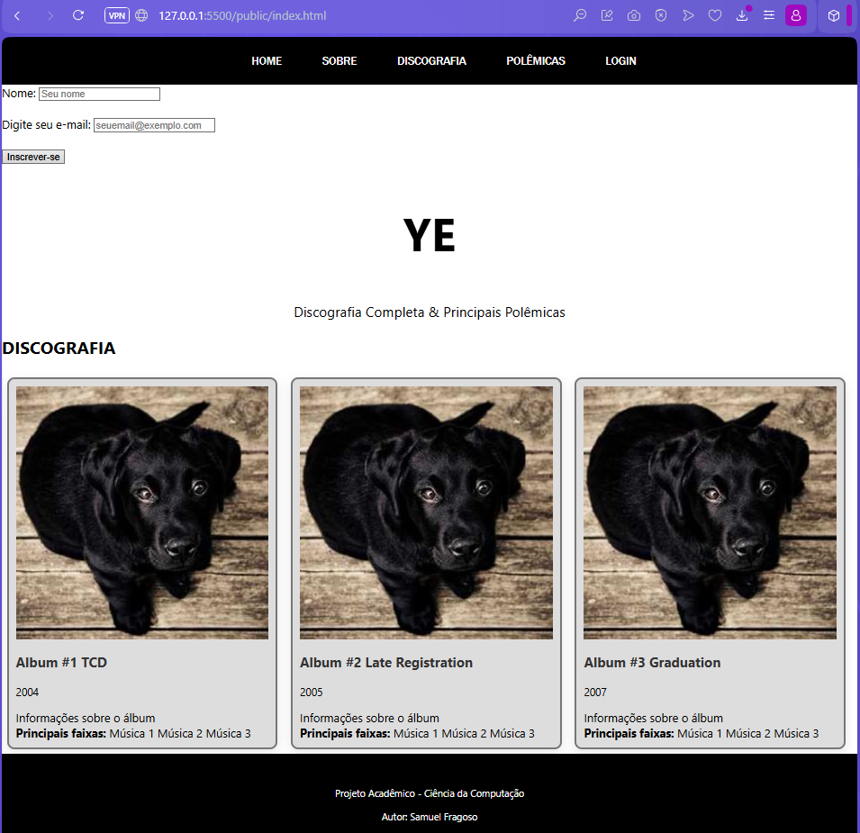

# Trabalho Prático - Semana 03

Dessa vez, vamos escolher uma proposta de projeto para trabalhar.

Nessa atividade, você deverá montar a página inicial do projeto escolhido, a organização do HTML aplicando semântica correta e uso aprimorado do CSS. Leia o enunciado completo no Canvas para mais detalhes.

**IMPORTANTE:** Você deve trabalhar e alterar apenas arquivos dentro da pasta **`public`**. Deixe todos os demais arquivos e pastas desse repositório inalterados. **PRESTE MUITA ATENÇÃO NISSO.**

## Informações Gerais

- Nome: Samuel
- Matricula: 902665
- Proposta de projeto escolhida:

     Proposta escolhida "1. Pessoas e Produções". Artistas e álbuns.
     O artista escolhido foi o rapper americano Ye e sua discografia.

- Breve descrição sobre seu projeto:

    O presente projeto tem como objetivo o desenvolvimento de uma página web utilizando as linguagens HTML e CSS, aplicando conceitos de estruturação semântica, estilização e responsividade. O tema escolhido foi o rapper Ye, abordando sua carreira musical por meio de uma apresentação de sua discografia e principais destaques.

    A página conta com elementos semânticos como header, nav, main, section, article e footer. Também foram aplicadas propriedades do box model, seletores hierárquicos e recursos visuais para organizar o conteúdo em seções e tornar a navegação mais intuitiva.
    

## Print do(s) wireframe(s) criado

## Print da home-page criada

